All of these font images are converted from my PNG versions in the 
directory up above this one.

All of these were converted by me, Scott Lawrence, using the png2pulp.php
script also in the above directory.

All of these are made available with an MIT license, so you can use them
for whatever projects you want, commercial or not, but just give me
credit.  :)

(basically CC-Attribution)

--------------------------------------------------------------------------------

<table>
<tr>
<th>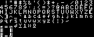 ADM-3A</th>
<th> Amiga Topaz 1</th>
<th> Amiga Topaz 2</th>
</tr><tr>
<th> Apple II</th>
<th> Atari 800</th>
<th> Commodore 128</th>
</tr><tr>
<th>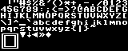 Commodore 64</th>
<th>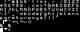 MSX</th>
<th>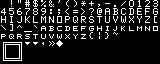 TI 99/4A</th>
</tr><tr>
<th>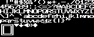 VT220</th>
<th>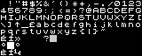 ZX Spectrum</th>
<th> DOS Block Sans</th>
</tr><tr>
<th>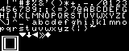 DOS Flat</th>
<th>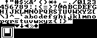 DOS Inverted</th>
<th>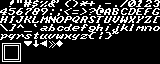 DOS Italics</th>
</tr><tr>
<th> DOS Sans</th>
<th> DOS Serif</th>
<th>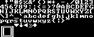 DOS Super</th>
</tr><tr>
<th>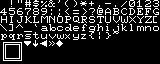 DOS Thin</th>
<th> DOS VGA</th>
</tr>
</table>
--------------------------------------------------------------------------------
The MIT License (MIT)

Copyright (c) 2022 Scott Lawrence / BleuLlama / yorgle@gmail.com

Permission is hereby granted, free of charge, to any person obtaining
a copy of this software and associated documentation files (the
"Software"), to deal in the Software without restriction, including
without limitation the rights to use, copy, modify, merge, publish,
distribute, sublicense, and/or sell copies of the Software, and to
permit persons to whom the Software is furnished to do so, subject
to the following conditions:

The above copyright notice and this permission notice shall be
included in all copies or substantial portions of the Software.

THE SOFTWARE IS PROVIDED "AS IS", WITHOUT WARRANTY OF ANY KIND,
EXPRESS OR IMPLIED, INCLUDING BUT NOT LIMITED TO THE WARRANTIES OF
MERCHANTABILITY, FITNESS FOR A PARTICULAR PURPOSE AND NONINFRINGEMENT.
IN NO EVENT SHALL THE AUTHORS OR COPYRIGHT HOLDERS BE LIABLE FOR
ANY CLAIM, DAMAGES OR OTHER LIABILITY, WHETHER IN AN ACTION OF
CONTRACT, TORT OR OTHERWISE, ARISING FROM, OUT OF OR IN CONNECTION
WITH THE SOFTWARE OR THE USE OR OTHER DEALINGS IN THE SOFTWARE.
